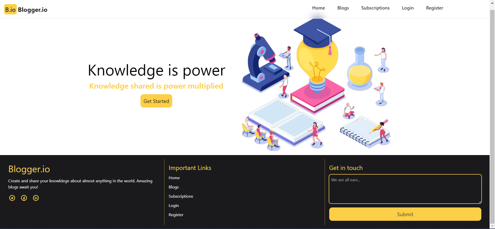
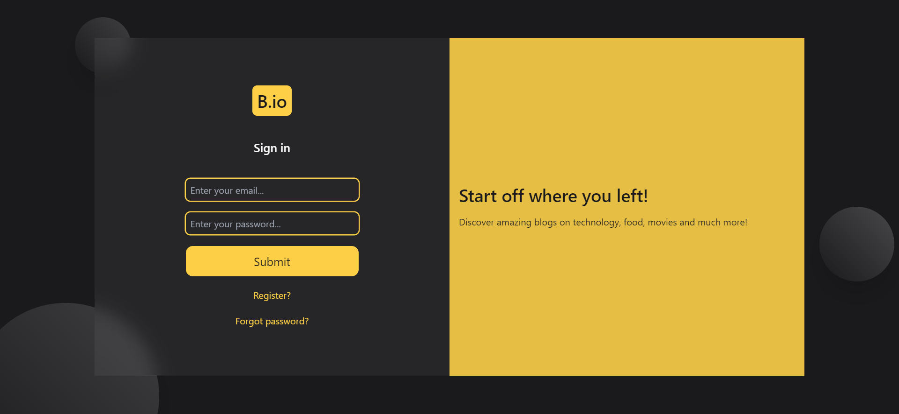
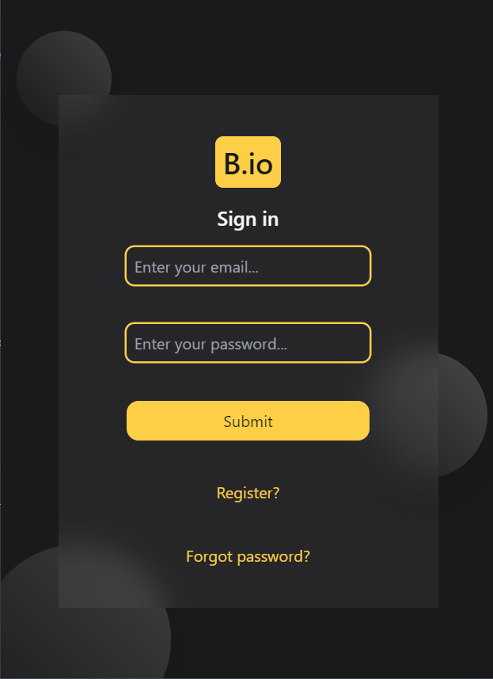

# Blog website

This is a simple blog website where users can post their blogs in various categories. This website is designed using ReactJS, React Router Dom for
navigation, Firebase for authentication and Tailwind CSS for styling. 

## Features

1. Create a new blog
2. Edit existing blogs created by the logged in user
3. Delete blogs created by logged in user
4. Add comments
5. Rate a blog
6. Like a blog
7. Sort and filter the blogs according to the requirement
8. Basic security using Firebase authentication

## Details

In this project, you will run into:

### `React JS`

React is a free and open-source front-end JavaScript library for building user interfaces based on components.

### `useState Hook`

useState is a Hook that lets you add React state to function components. This react hook is used for a lot of different purposes in this project. Some of them are:
1. Passing values between components
2. Sorting the blogs
3. Responsive design

### `Tailwind CSS`

This web app uses tailwind css for styling.

### `HTML`

Well, you cannot get anywhere without the basics.
